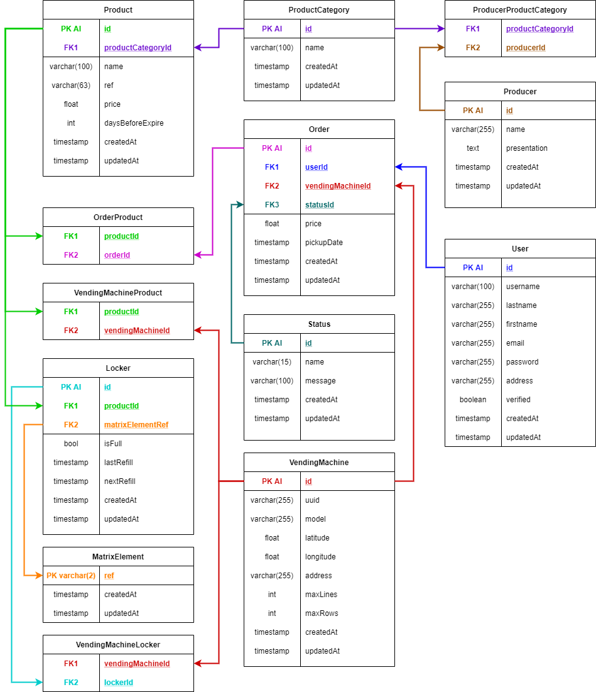

# Hemengo API
This is the REST API I made to distribute data to our various Hemengo interfaces (school project).
It is made with Express (-_-), Sequelize as ORM and MySQL as DBMS. 
There're some unit tests written with Jasmine.
Documented with Apidoc, an ounce of CI was introduced with Jenkins and Docker.

Logical Data Model of the database :
------------------------------------------------

